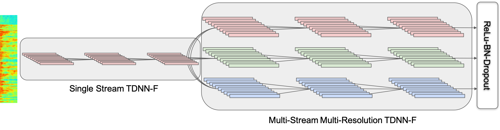

Multistream Convolutional Neural Network (CNN)
==============================================

A multistream CNN is a novel neural network architecture for robust acoustic modeling in speech recognition tasks. It processes input speech with diverse resolutions by applying different dilation rates to convolutional neural networks across multiple streams to achieve the robustness. The dilation rate of 3 are selected from the multiples of a sub-sampling rate of 3 frames. Each stream stacks TDNN-F layers (a variant of 1D CNN), and output embedding vectors from the streams are concatenated then projected to the final layer, as illustrated below:



### Reference
Multistream CNN for Robust Acoustic Modeling [[paper](https://arxiv.org/pdf/2005.10470.pdf)]
```
{
  @inproceedings{han2021multistream-cnn,
    title={Multistream CNN for Robust Acoustic Modeling},
    author={Kyu J. Han and Jing Pan and Venkata Krishna Naveen Tadala and Tao Ma and Dan Povey},
    booktitle={IEEE International Conference on Acoustics, Speech and Signal Processing (ICASSP)},
    year={2021}
}
```
ASAPP-ASR: Multistream CNN and Self-Attentive SRU for SOTA Speech Recognition [[paper](https://arxiv.org/pdf/2005.10469.pdf)]
```
{
  @inproceedings{pan2020asapp-asr,
    title={ASAPP-ASR: Multistream CNN and Self-Attentive SRU for SOTA Speech Recognition},
    author={Jing Pan and Joshua Shapiro and Jeremy Wohlwend and Kyu J. Han and Tao Lei and Tao Ma},
    booktitle={Interspeech},
    year={2020}
}
```
